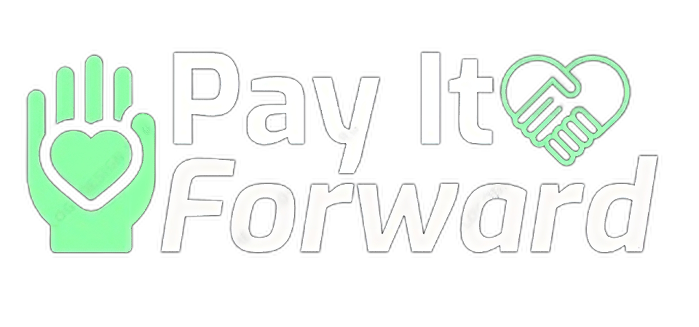
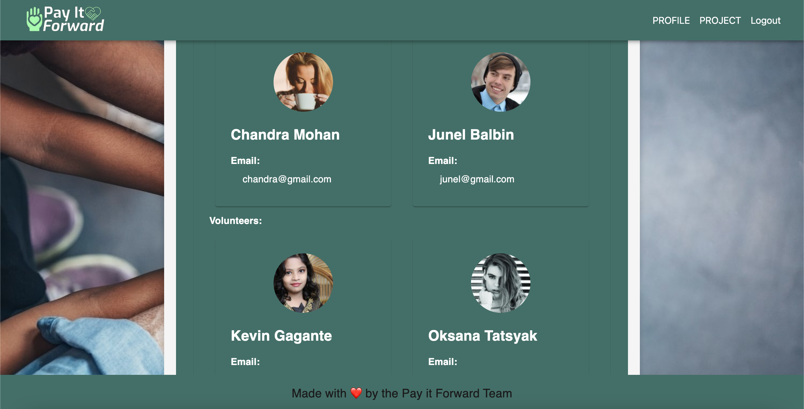

# Project 3: Pay it Forward

## 🌏 Table of Contents:
- [Description](#description)
- [Installation](#installation)
- [Usage](#usage)
- [Application UI](#application-user-interface)
- [Team Members & Roles](#team-members-and-roles)
- [Credits & Resources](#credits-and-resources)
- [Coded With](#coded-with)
- [Contributing](#contributing)
- [Project Links](#project-links)
- [License](#license)

## Description:
* <strong>Pay it Forward:</strong> is a Social Network Platform that connects volunteers with service projects, cultivates acts of kindness, and builds caring communities.
* <strong>Mission:</strong> To foster compassion, connect volunteers with service projects and build meaningful relationships to create a better society. 
* <strong>Vision:</strong> Building a world where acts of kindness and service are accessible to all.

### User Story

```md
Given a platform that allows organizations to share their fundraisers and volunteer events
When I log onto the website 
Then I am presented with various volunteering opportunities and charities in or around my area
When I choose to join a volunteer group
Then it is tracked and can be shared on my profile
When I contribute to a charity 
Then a post is made showing my contribution and highlighting the organization
When I search for volunteering opportunities by name or area 
Then I am returned a relevant list of opportunities happening near me
When I send a message into the chat 
Then it is posted and other users can communicate and respond in the chat    
```

## Installation:
* `git clone git@github.com:chandraucb/payitforward.git`
* `npm install to install all dependencies`
* `npm start to start the application `

## Usage:
* [Deployed Heroku: Pay it Forward](https://payitforward-app-46493cd9589e.herokuapp.com/)

## Application User Interface:



## Team Members and Roles:
* <strong>Chandra:</strong> Github Repo Creation, Server build and Authentication build.
* <strong>Carlos:</strong> Styling, Component Creation, Page Creation and Server build.
* <strong>Kevin:</strong> Server build, Styling, Component build, Seeds and Page build.
* <strong>Junel:</strong> Component build, Page build, Seeds and Server build.
* <strong>Oksana:</strong> Component build, Page build and Concept.


## Credits and Resources:
* Google search & Youtube videos.
* ChatGpt for troubleshooting.
* Source Code by EDX & UCB.
* Material UI Documentation.
* Instructor: Robbert W.
* TA: Kyle Vance.
* UCB Tutors. 

## Coded With:
* Emotion CSS.
* Material UI.
* Express.js
* MongoDB.
* GraphQL.
* React JS.
* VS Code.
* Node.js.
* Heroku.
* Apollo.

## Contributing:
* Open to contributions.

## Project Links:
* [Deployed Heroku](https://payitforward-app-46493cd9589e.herokuapp.com/)
* [Github Repository](https://github.com/chandraucb/payitforward)
* [Presentation](https://docs.google.com/presentation/d/1pO2XIUwBA6MG65ih-0xgYYChhczAM1CooJPCOSsAeq0/edit?usp=sharing)

## License:
[](https://opensource.org/licenses/MIT)


